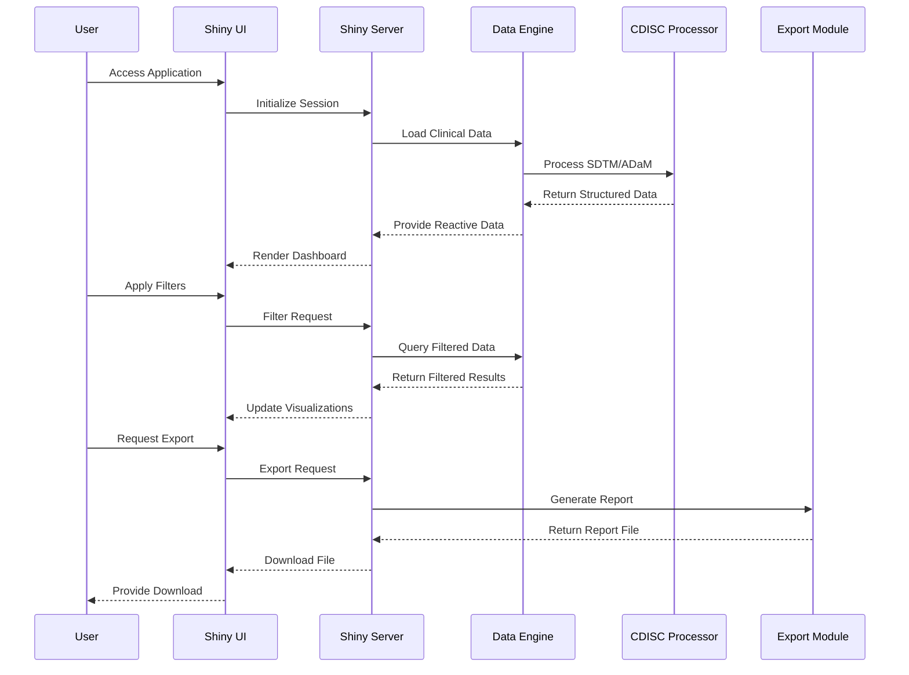

# Clinical Data Viewer - Workflow Architecture

## 📊 **System Architecture Diagram**

```mermaid
graph TB
    %% Data Sources
    subgraph "Data Sources"
        A[Raw Clinical Data<br/>CSV/SAS7BDAT Files]
        B[CDISC Metadata<br/>Define-XML]
        C[Study Protocol<br/>PDF/Word]
    end

    %% Data Processing Layer
    subgraph "Data Processing Layer"
        D[Data Validation<br/>• Format Checks<br/>• Range Validation<br/>• Completeness Checks]
        E[CDISC Transformation<br/>• SDTM Creation<br/>• ADaM Generation<br/>• Metadata Mapping]
        F[Quality Control<br/>• Data Profiling<br/>• Consistency Checks<br/>• Audit Trail]
    end

    %% Core Application
    subgraph "Clinical Data Viewer Application"
        G[Data Engine<br/>• Reactive Data Store<br/>• Caching Layer<br/>• State Management]
        H[UI Controller<br/>• Dashboard Layout<br/>• Interactive Filters<br/>• Navigation]
        I[Visualization Engine<br/>• Plotly Charts<br/>• DT Tables<br/>• ggplot2 Graphics]
        J[Export Module<br/>• PDF Reports<br/>• Excel Export<br/>• CSV Download]
    end

    %% User Interface
    subgraph "User Interface"
        K[Dashboard View<br/>• Overview Metrics<br/>• KPI Cards<br/>• Status Indicators]
        L[Data Explorer<br/>• Tabular View<br/>• Advanced Filters<br/>• Search Functionality]
        M[Analytics View<br/>• Interactive Charts<br/>• Statistical Plots<br/>• Trend Analysis]
        N[Export Center<br/>• Report Generation<br/>• Data Export<br/>• Documentation]
    end

    %% Output Layer
    subgraph "Outputs & Deliverables"
        O[Regulatory Reports<br/>• CSR Sections<br/>• Tables & Figures<br/>• Appendix]
        P[Data Packages<br/>• SDTM Datasets<br/>• ADaM Datasets<br/>• Define-XML]
        Q[Analysis Results<br/>• Statistical Summaries<br/>• Safety Analysis<br/>• Efficacy Analysis]
        R[Documentation<br/>• Data Dictionary<br/>• Validation Report<br/>• Audit Log]
    end

    %% Connections
    A --> D
    B --> E
    C --> E
    D --> E
    E --> F
    F --> G
    G --> H
    G --> I
    G --> J
    H --> K
    H --> L
    I --> M
    J --> N
    K --> O
    L --> P
    M --> Q
    N --> R

    %% Styling
    classDef dataSource fill:#e1f5fe,stroke:#01579b,stroke-width:2px
    classDef processing fill:#f3e5f5,stroke:#4a148c,stroke-width:2px
    classDef application fill:#e8f5e8,stroke:#1b5e20,stroke-width:2px
    classDef interface fill:#fff3e0,stroke:#e65100,stroke-width:2px
    classDef output fill:#fce4ec,stroke:#880e4f,stroke-width:2px

    class A,B,C dataSource
    class D,E,F processing
    class G,H,I,J application
    class K,L,M,N interface
    class O,P,Q,R output
end
```

## 🔄 **Data Flow Diagram**

```mermaid
flowchart LR
    %% Input Stage
    subgraph "Input Stage"
        A1[Raw Clinical Data<br/>• Demographics<br/>• Vital Signs<br/>• Adverse Events<br/>• Lab Results]
        A2[Study Metadata<br/>• Protocol Info<br/>• Variable Definitions<br/>• Validation Rules]
    end

    %% Processing Stage
    subgraph "Processing Stage"
        B1[Data Import<br/>• File Reading<br/>• Format Detection<br/>• Encoding Handling]
        B2[Data Cleaning<br/>• Missing Value Handling<br/>• Outlier Detection<br/>• Consistency Checks]
        B3[CDISC Mapping<br/>• SDTM Structure<br/>• Variable Naming<br/>• Controlled Terms]
        B4[ADaM Creation<br/>• Analysis Variables<br/>• Derived Parameters<br/>• Flag Variables]
    end

    %% Analysis Stage
    subgraph "Analysis Stage"
        C1[Descriptive Stats<br/>• Summary Tables<br/>• Frequency Counts<br/>• Demographics]
        C2[Safety Analysis<br/>• AE Summaries<br/>• Lab Shifts<br/>• Vital Sign Changes]
        C3[Efficacy Analysis<br/>• Endpoints<br/>• Subgroup Analysis<br/>• Time Trends]
        C4[Data Visualization<br/>• Interactive Plots<br/>• Statistical Charts<br/>• Heatmaps]
    end

    %% Output Stage
    subgraph "Output Stage"
        D1[Interactive Dashboard<br/>• Real-time Updates<br/>• Dynamic Filters<br/>• Responsive Design]
        D2[Export Reports<br/>• PDF Generation<br/>• Excel Workbooks<br/>• CSV Files]
        D3[Regulatory Packages<br/>• SDTM Datasets<br/>• ADaM Datasets<br/>• Define-XML]
    end

    %% Flow Connections
    A1 --> B1
    A2 --> B1
    B1 --> B2
    B2 --> B3
    B3 --> B4
    B4 --> C1
    B4 --> C2
    B4 --> C3
    C1 --> C4
    C2 --> C4
    C3 --> C4
    C4 --> D1
    C4 --> D2
    C4 --> D3

    %% Styling
    classDef input fill:#e3f2fd,stroke:#1565c0,stroke-width:2px
    classDef process fill:#f3e5f5,stroke:#7b1fa2,stroke-width:2px
    classDef analysis fill:#e8f5e8,stroke:#388e3c,stroke-width:2px
    classDef output fill:#fff3e0,stroke:#f57c00,stroke-width:2px

    class A1,A2 input
    class B1,B2,B3,B4 process
    class C1,C2,C3,C4 analysis
    class D1,D2,D3 output
end
```

## 🎯 **Technical Implementation Flow**



## 📊 **Input/Output Specifications**

### **📥 Input Specifications**

#### **Raw Clinical Data**
```yaml
Input Types:
  - CSV Files: 
    - Format: UTF-8, comma-delimited
    - Size: Up to 100MB per file
    - Structure: Flat files with headers
  
  - SAS7BDAT Files:
    - Format: SAS proprietary format
    - Size: Up to 500MB per file
    - Structure: SAS datasets
  
  - Excel Files:
    - Format: .xlsx, .xls
    - Size: Up to 50MB per file
    - Structure: Multiple worksheets

Required Variables:
  Demographics (DM):
    - STUDYID: Study Identifier
    - SITEID: Site Identifier  
    - USUBJID: Unique Subject ID
    - AGE: Subject Age
    - SEX: Subject Sex
    - RACE: Subject Race
    - ARM: Treatment Arm

  Vital Signs (VS):
    - VSTESTCD: Test Code
    - VSTEST: Test Name
    - VSORRES: Result Value
    - VSORRESU: Result Units
    - VISIT: Visit Name

  Adverse Events (AE):
    - AETERM: Preferred Term
    - AESEV: Severity
    - AEREL: Relatedness
    - AEACN: Action Taken
```

#### **Study Metadata**
```yaml
Metadata Types:
  - Define-XML:
    - Format: XML
    - Standard: CDISC Define-XML v2.0
    - Content: Variable definitions, controlled terms
  
  - Protocol Information:
    - Format: PDF, Word
    - Content: Study design, endpoints, schedule
  
  - Validation Rules:
    - Format: JSON, YAML
    - Content: Data quality checks, constraints
```

### **📤 Output Specifications**

#### **Interactive Dashboard**
```yaml
Dashboard Components:
  - Overview Tab:
    - Study Summary Metrics
    - Subject Disposition
    - Data Completeness Status
    - KPI Cards with real-time updates

  - Demographics Tab:
    - Interactive Demographics Table
    - Age Distribution Plot
    - Gender/Race Breakdown
    - Site Performance Metrics

  - Vital Signs Tab:
    - Time Series Plots
    - Change from Baseline
    - Outlier Detection
    - Summary Statistics

  - Adverse Events Tab:
    - AE Summary Tables
    - Severity Distribution
    - Relationship Analysis
    - Timeline View

Technical Specifications:
  - Framework: Shiny + shinydashboard
  - Visualization: plotly + ggplot2
  - Tables: DT with advanced filtering
  - Performance: Reactive programming with caching
  - Responsive: Mobile-compatible design
```

#### **Export Reports**
```yaml
Report Types:
  - PDF Reports:
    - Format: A4, landscape/portrait
    - Content: Tables, figures, narratives
    - Standards: FDA/EMA submission ready
    - Size: Up to 50 pages

  - Excel Workbooks:
    - Format: .xlsx with multiple worksheets
    - Content: SDTM/ADaM datasets, analysis results
    - Features: Formatted tables, charts, pivot tables
    - Size: Up to 10MB

  - CSV Files:
    - Format: UTF-8, comma-delimited
    - Content: Analysis datasets, summary tables
    - Features: Header rows, data dictionary
    - Size: Up to 25MB

Regulatory Compliance:
  - CDISC Standards: SDTM v3.3, ADaM v1.1
  - FDA Guidelines: 21 CFR Part 11 compliance
  - EMA Requirements: EU clinical trial regulations
  - Quality: Audit trail, version control, validation
```

## 🚀 **Performance Specifications**

```yaml
System Requirements:
  - Memory: Minimum 4GB RAM, recommended 8GB+
  - Storage: 1GB application + 10GB data capacity
  - CPU: Multi-core processor for parallel processing
  - Network: Broadband connection for remote access

Performance Metrics:
  - Load Time: < 5 seconds for initial dashboard
  - Filter Response: < 2 seconds for data updates
  - Export Time: < 30 seconds for report generation
  - Concurrent Users: Support for 50+ simultaneous users

Scalability:
  - Data Volume: Handle up to 10,000 subjects
  - File Size: Process files up to 1GB each
  - Database: Support for PostgreSQL, Oracle, SQL Server
  - Cloud: Deployable on AWS, Azure, GCP
```

## 🔧 **Technical Architecture**

```mermaid
graph TB
    subgraph "Frontend Layer"
        A[Shiny UI<br/>• Dashboard Components<br/>• Interactive Controls<br/>• Responsive Design]
        B[JavaScript<br/>• Plotly.js<br/>• DataTables<br/>• Custom Handlers]
    end

    subgraph "Backend Layer"
        C[R Server<br/>• Shiny Server<br/>• Session Management<br/>• Load Balancing]
        D[Data Processing<br/>• dplyr<br/>• data.table<br/>• Parallel Computing]
    end

    subgraph "Data Layer"
        E[File System<br/>• CSV/SAS Files<br/>• Excel Sheets<br/>• JSON Config]
        F[Database<br/>• PostgreSQL<br/>• Oracle<br/>• SQL Server]
    end

    subgraph "Integration Layer"
        G[CDISC Tools<br/>• Admiral Package<br/>• xport<br/>• Metadata]
        H[Export Services<br/>• PDF Generation<br/>• Excel Export<br/>• Email Delivery]
    end

    A --> C
    B --> C
    C --> D
    D --> E
    D --> F
    D --> G
    D --> H

    classDef frontend fill:#e1f5fe,stroke:#01579b,stroke-width:2px
    classDef backend fill:#f3e5f5,stroke:#4a148c,stroke-width:2px
    classDef data fill:#e8f5e8,stroke:#1b5e20,stroke-width:2px
    classDef integration fill:#fff3e0,stroke:#e65100,stroke-width:2px

    class A,B frontend
    class C,D backend
    class E,F data
    class G,H integration
end
```

This comprehensive workflow diagram shows the complete Clinical Data Viewer architecture from data ingestion through regulatory-ready outputs, perfect for demonstrating your senior-level understanding of clinical data systems!
