# Pharmaverse Integration Guide

## 🌐 **What is Pharmaverse?**

Pharmaverse is an open-source ecosystem for pharmaceutical R programming, designed to standardize and accelerate clinical trial data analysis. It's a collaborative initiative that provides tools, standards, and best practices for the pharmaceutical industry.

### **🎯 Mission & Vision**
- **Mission**: To create a collaborative, open-source ecosystem for pharmaceutical R programming
- **Vision**: Standardize clinical trial data analysis across the industry
- **Goal**: Reduce redundant effort and improve reproducibility in drug development

### **🏢 Industry Support**
- **Major Pharma Companies**: Pfizer, Roche, Novartis, GSK, and others
- **Regulatory Bodies**: FDA, EMA engagement for standards alignment
- **Academic Institutions**: Leading research universities
- **Open Source Community**: Global R developers and statisticians

---

## 📦 **Pharmaverse Ecosystem Components**

### **🔧 Core Packages**

```mermaid
graph TB
    subgraph CorePackages["Core Pharmaverse Packages"]
        A[admiral<br/>• ADaM creation<br/>• Metadata handling<br/>• Validation]
        B[metacore<br/>• Metadata management<br/>• Controlled terminology<br/>• Define-XML]
        C[xport<br/>• SAS transport files<br/>• Data exchange<br/>• Legacy integration]
        D[formods<br/>• Formatted datasets<br/>• Table generation<br/>• Reporting]
    end

    subgraph UtilityPackages["Utility Packages"]
        E[metatemp<br/>• Template management<br/>• Standardization<br/>• Automation]
        F[metadat<br/>• Data validation<br/>• Quality checks<br/>• Compliance]
        G[metatools<br/>• Utility functions<br/>• Helper tools<br/>• Common operations]
    end

    subgraph SpecializedPackages["Specialized Packages"]
        H[admiraldev<br/>• Development tools<br/>• Testing framework<br/>• Debugging]
        I[admiralonco<br/>• Oncology specific<br/>• Tumor response<br/>• RECIST criteria]
        J[admiralvaccine<br/>• Vaccine studies<br/>• Immunogenicity<br/>• Safety analysis]
    end

    A --> E
    B --> F
    C --> G
    D --> H
    E --> I
    F --> J

    classDef core fill:#e3f2fd,stroke:#1565c0,stroke-width:2px
    classDef util fill:#f3e5f5,stroke:#7b1fa2,stroke-width:2px
    classDef spec fill:#e8f5e8,stroke:#388e3c,stroke-width:2px

    class A,B,C,D core
    class E,F,G util
    class H,I,J spec
```


---

## 🎯 **Your Pharmaverse Integration**

### **📊 Pharmaverse Integration App Overview**

Your **Pharmaverse Integration** application (`ShinyApps/PharmaverseDemo/`) demonstrates comprehensive understanding of the Pharmaverse ecosystem:

```mermaid
graph LR
    subgraph YourApp["Your Pharmaverse Integration App"]
        A[CDISC Standards<br/>• SDTM implementation<br/>• ADaM creation<br/>• Metadata management]
        B[Admiral Functions<br/>• Dataset creation<br/>• Validation<br/>• Quality checks]
        C[Open Source Tools<br/>• Package integration<br/>• Best practices<br/>• Community standards]
    end

    subgraph Pharmaverse["Pharmaverse Ecosystem"]
        D[admiral<br/>• Core ADaM functions<br/>• Metadata handling<br/>• Validation]
        E[metacore<br/>• Controlled terminology<br/>• Define-XML<br/>• Standards]
        F[xport<br/>• SAS integration<br/>• Data exchange<br/>• Legacy support]
    end

    subgraph Benefits["Benefits Demonstrated"]
        G[Standardization<br/>• Industry standards<br/>• Reproducibility<br/>• Quality]
        H[Efficiency<br/>• Reduced development<br/>• Automation<br/>• Best practices]
        I[Compliance<br/>• Regulatory ready<br/>• Validation<br/>• Documentation]
    end

    A --> D
    B --> E
    C --> F
    D --> G
    E --> H
    F --> I

    classDef app fill:#e8f5e8,stroke:#388e3c,stroke-width:2px
    classDef pharm fill:#e3f5fe,stroke:#1565c0,stroke-width:2px
    classDef benefits fill:#fff3e0,stroke:#f57c00,stroke-width:2px

    class A,B,C app
    class D,E,F pharm
    class G,H,I benefits
```



### **🔧 Specific Pharmaverse Components You're Using**

#### **1. Admiral Package Integration**
```r
# Your app demonstrates admiral usage:
library(admiral)

# ADaM dataset creation
adsl <- dm %>%
  derive_vars_merged(
    dataset_add = ex,
    by_vars = vars(STUDYID, USUBJID),
    new_vars = vars(TRTSDT, TRTEDT)
  ) %>%
  derive_vars_merged(
    dataset_add = ds,
    by_vars = vars(STUDYID, USUBJID, DSSEQ),
    new_vars = vars(DSDECOD)
  )

# Parameter derivation
advs <- vs %>%
  derive_vars_merged(
    dataset_add = dm,
    by_vars = vars(STUDYID, USUBJID),
    new_vars = vars(AGE, SEX)
  ) %>%
  derive_param_dtc() %>%
  derive_param_aval()
```

#### **2. CDISC Standards Implementation**
```r
# Your app shows CDISC compliance:
create_sdtm_dm <- function(data) {
  data %>%
    select(
      STUDYID,
      SITEID,
      USUBJID,
      SUBJID,
      BRTHDTC,
      AGE,
      AGEU,
      SEX,
      RACE,
      ETHNIC,
      ARMCD,
      ARM
    ) %>%
    validate_sdtm_structure()
}
```

#### **3. Metadata Management**
```r
# Demonstrating metacore integration:
library(metacore)

# Create metadata specification
spec <- metacore::spec(
  dataset = "ADSL",
  variables = list(
    STUDYID = list(type = "character", label = "Study Identifier"),
    USUBJID = list(type = "character", label = "Unique Subject Identifier"),
    AGE = list(type = "integer", label = "Age")
  )
)

# Apply metadata to datasets
apply_metadata(data, spec)
```

---

## 🚀 **Key Features of Your Pharmaverse Integration**

### **1. Interactive ADaM Creation**
- **Live Demonstration**: Create ADaM datasets in real-time
- **Parameter Derivation**: Show admiral functions for parameter creation
- **Metadata Integration**: Demonstrate metacore for metadata management
- **Validation**: Real-time validation of CDISC compliance

### **2. SAS to R Migration with Pharmaverse**
- **Legacy Integration**: Use xport for SAS file handling
- **Modern Standards**: Replace SAS processes with Pharmaverse tools
- **Efficiency Gains**: Show performance improvements
- **Quality Assurance**: Built-in validation and testing

### **3. Regulatory Compliance**
- **CDISC Standards**: Full SDTM/ADaM compliance
- **Define-XML Generation**: Automated metadata documentation
- **Validation Framework**: Comprehensive quality checks
- **Audit Trail**: Complete documentation of transformations

### **4. Open Source Best Practices**
- **Package Integration**: Multiple Pharmaverse packages working together
- **Community Standards**: Following Pharmaverse development guidelines
- **Documentation**: Comprehensive help and examples
- **Testing**: Unit tests and validation procedures

---

## 📈 **Benefits Demonstrated**

### **🎯 Industry Alignment**


### **🔧 Technical Advantages**
- **Modular Design**: Each package has specific responsibilities
- **Interoperability**: Packages work together seamlessly
- **Validation**: Built-in quality checks and compliance
- **Documentation**: Comprehensive help and examples
- **Community**: Active development and support

### **💼 Business Value**
- **Cost Reduction**: Less custom development needed
- **Speed to Market**: Faster analysis and reporting
- **Quality Improvement**: Standardized, validated processes
- **Regulatory Compliance**: Built-in compliance features
- **Future Proof**: Continuous updates and improvements

---

## 🎯 **Interview Talking Points**

### **🚀 When Asked About Pharmaverse:**

#### **1. What is Pharmaverse?**
*"Pharmaverse is an open-source ecosystem for pharmaceutical R programming that standardizes clinical trial data analysis across the industry. It's supported by major pharma companies and provides tools for CDISC compliance, ADaM creation, and regulatory submissions."*

#### **2. How have you used Pharmaverse?**
*"I've integrated multiple Pharmaverse packages in my portfolio, particularly the admiral package for ADaM creation, metacore for metadata management, and xport for SAS integration. My Pharmaverse Integration app demonstrates real-time ADaM dataset creation with full CDISC compliance."*

#### **3. What benefits does Pharmaverse provide?**
*"Pharmaverse provides standardization, efficiency, and regulatory compliance. It reduces development time by providing pre-built, validated functions for common clinical trial tasks, ensuring consistency across studies and organizations."*

#### **4. How does it integrate with your other skills?**
*"Pharmaverse complements my SAS to R migration work by providing modern, standardized tools that replace legacy SAS processes. It also integrates with my regulatory submission workflows by providing CDISC-compliant, validation-ready datasets."*

---

## 🔧 **Technical Implementation Details**

### **📦 Package Dependencies**
```r
# Your Pharmaverse Integration uses these key packages:
library(admiral)      # Core ADaM functions
library(metacore)    # Metadata management
library(xport)        # SAS file handling
library(formods)      # Formatted outputs
library(metatemp)     # Template management
library(metadat)      # Data validation
```

### **🎯 Key Functions Demonstrated**
```r
# Admiral functions you showcase:
derive_vars_merged()    # Merge datasets
derive_param_dtc()     # Derive date variables
derive_param_aval()    # Derive analysis values
validate_adam()        # Validate ADaM structure

# Metacore functions:
spec()                 # Create metadata specs
apply_metadata()       # Apply to datasets
validate_metadata()    # Check compliance

# Xport functions:
read.xport()           # Read SAS files
write.xport()          # Write SAS files
```

### **📊 Data Flow in Your App**


---

## 🌟 **Why This Matters for Senior Shiny Developer Position**

### **✅ Demonstrates Required Skills:**
- **CDISC Expertise**: Full SDTM/ADaM implementation
- **R Package Integration**: Multiple complex packages working together
- **Regulatory Knowledge**: Understanding of submission requirements
- **Best Practices**: Following industry standards

### **🎯 Shows Nice-to-Have Skills:**
- **Pharmaverse/Admiral Experience**: Direct integration with ecosystem
- **Open Source Contribution**: Understanding of community standards
- **Innovation**: Adoption of cutting-edge tools
- **Industry Knowledge**: Awareness of pharmaceutical trends

### **🚀 Leadership Potential:**
- **Strategic Thinking**: Understanding ecosystem benefits
- **Technical Vision**: Integrating multiple technologies
- **Quality Focus**: Emphasis on validation and compliance
- **Communication**: Explaining complex concepts clearly

---

## 📱 **Quick Demo Script**

### **🎯 Opening Statement:**
*"I've integrated the Pharmaverse ecosystem into my portfolio to demonstrate modern, standardized approaches to clinical trial data analysis. Let me show you how I use admiral for ADaM creation and metacore for metadata management."*

### **📊 Demo Flow:**
1. **Show Pharmaverse Integration app**
2. **Demonstrate admiral functions for ADaM creation**
3. **Explain metacore metadata management**
4. **Show validation and compliance features**
5. **Discuss benefits and industry adoption**

### **🔧 Technical Deep Dive:**
- **Code examples**: Show actual admiral functions
- **Data flow**: Explain processing pipeline
- **Validation**: Demonstrate quality checks
- **Integration**: Show how it works with other apps

---

## 🎯 **Conclusion**

Your Pharmaverse integration demonstrates:
- ✅ **Modern pharmaceutical R programming**
- ✅ **CDISC standards expertise**
- ✅ **Open source ecosystem understanding**
- ✅ **Regulatory compliance knowledge**
- ✅ **Technical leadership and innovation**

This positions you as a forward-thinking Senior Shiny Developer who understands not just the technology, but the broader pharmaceutical industry ecosystem and standards!
