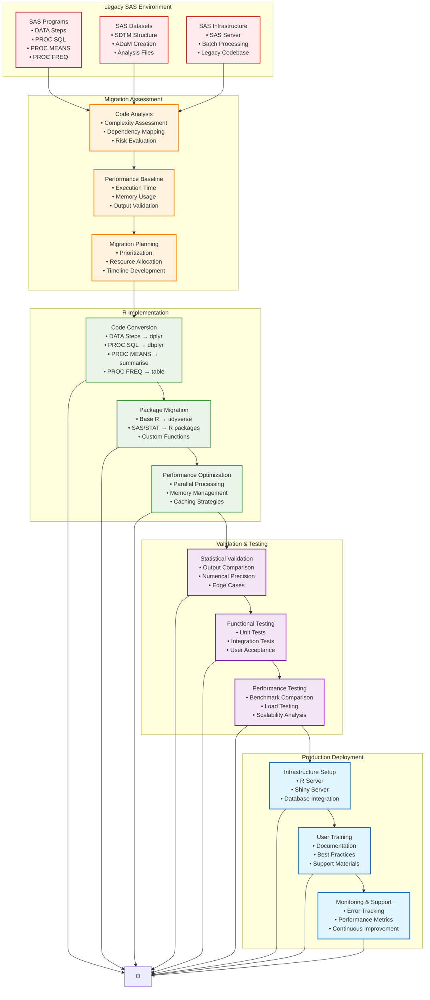
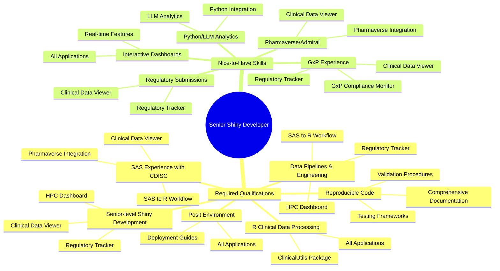
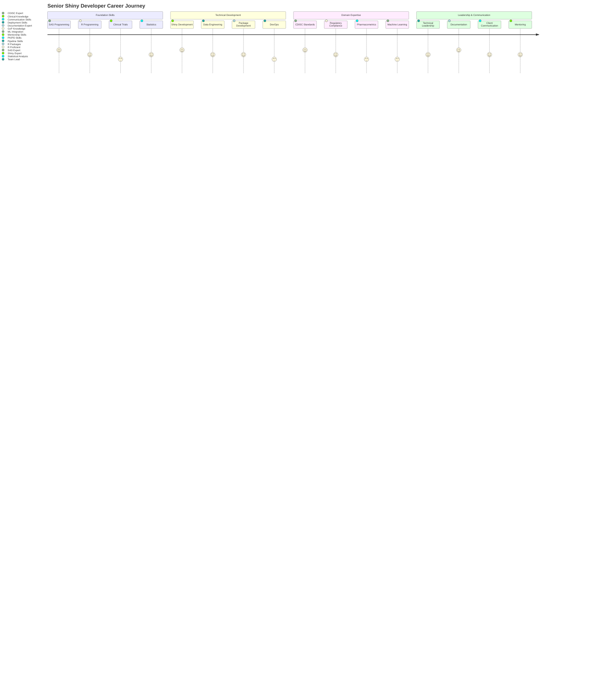
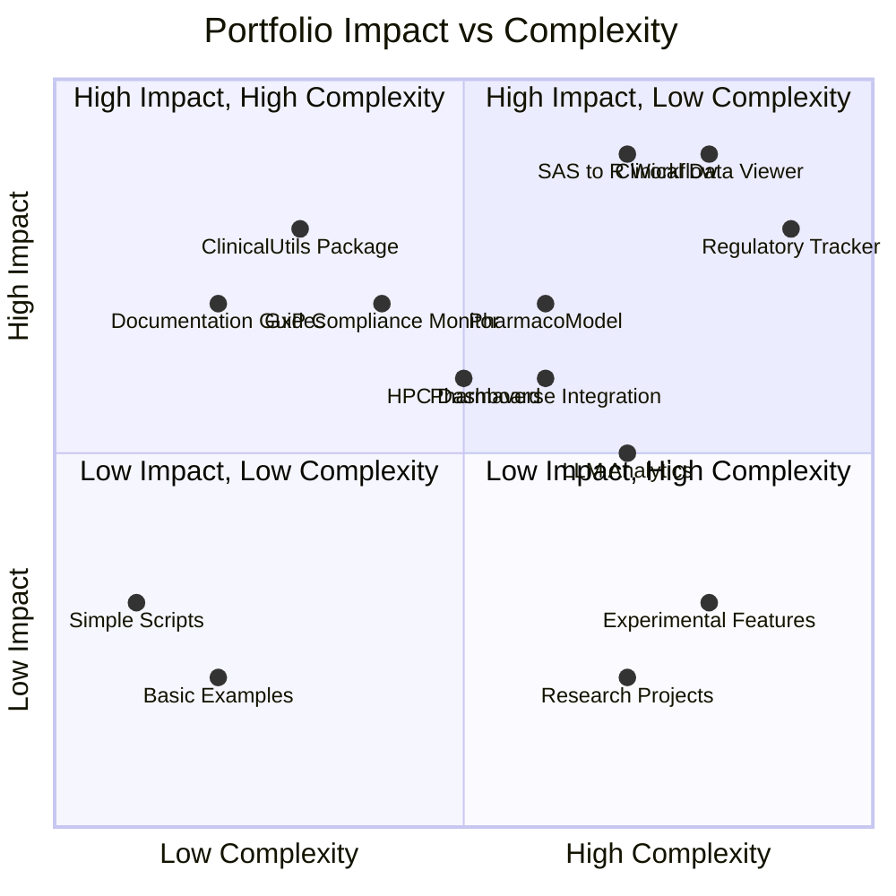
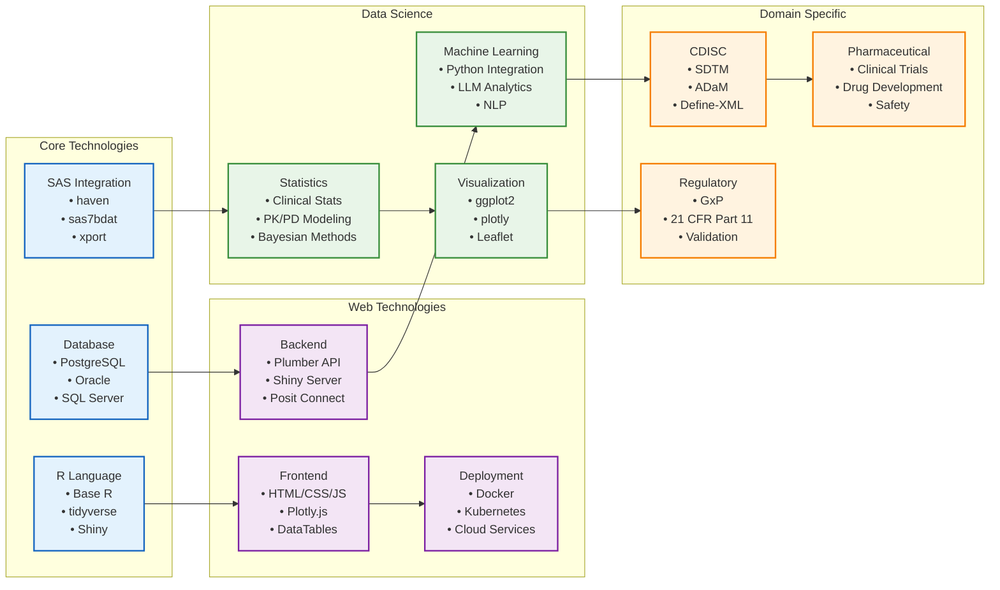
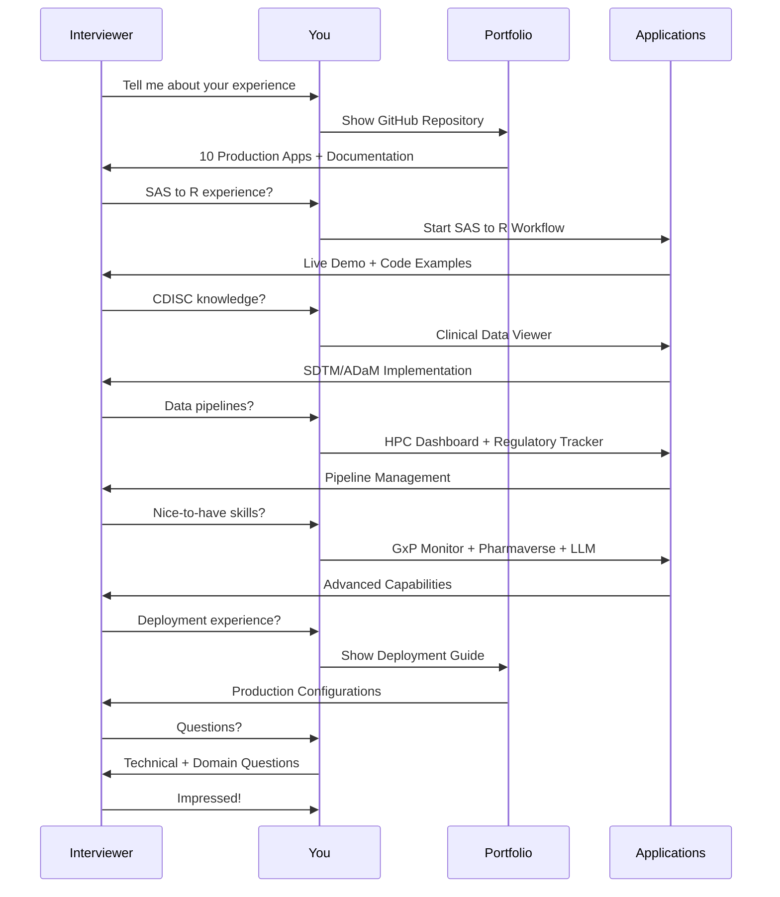

# Senior Shiny Developer - Complete Clinical Development Workflow

## 🏥 **End-to-End Clinical Trial Data Workflow**

```mermaid
graph TB
    %% Study Design Phase
    subgraph "Study Design & Setup"
        A[Protocol Development<br/>• Study Objectives<br/>• Endpoints Definition<br/>• Statistical Analysis Plan]
        B[CRF Design<br/>• Case Report Forms<br/>• Data Collection<br/>• Validation Rules]
        C[Database Setup<br/>• EDC Configuration<br/>• User Management<br/>• Access Controls]
    end

    %% Data Collection Phase
    subgraph "Data Collection & Entry"
        D[Clinical Sites<br/>• Data Entry<br/>• Query Resolution<br/>• Source Verification]
        E[Data Management<br/>• Data Cleaning<br/>• Medical Coding<br/>• Reconciliation]
        F[Safety Monitoring<br/>• AE Reporting<br/>• SAE Tracking<br/>• DSMB Reviews]
    end

    %% Data Processing Phase
    subgraph "Data Processing & Analysis"
        G[SAS Data Processing<br/>• Data Extraction<br/>• Dataset Creation<br/>• Statistical Analysis]
        H[R Migration Pipeline<br/>• SAS to R Conversion<br/>• CDISC Implementation<br/>• Validation Framework]
        I[Advanced Analytics<br/>• PK/PD Modeling<br/>• Bayesian Analysis<br/>• Machine Learning]
    end

    %% Regulatory Submission Phase
    subgraph "Regulatory & Submission"
        J[Submission Preparation<br/>• CSR Development<br/>• Document Assembly<br/>• Quality Control]
        K[Regulatory Review<br/>• Authority Queries<br/>• Response Management<br/>• Lifecycle Management]
        L[Post-Marketing<br/>• Safety Surveillance<br/>• Signal Detection<br/>• Risk Management]
    end

    %% Your Portfolio Applications
    subgraph "Your Shiny Portfolio Solutions"
        M[Clinical Data Viewer<br/>• SDTM/ADaM Visualization<br/>• Interactive Analysis<br/>• Export Functions]
        N[Regulatory Tracker<br/>• Submission Pipeline<br/>• Task Management<br/>• Document Control]
        O[SAS to R Workflow<br/>• Code Conversion<br/>• Performance Comparison<br/>• Migration Tools]
        P[PharmacoModel Dashboard<br/>• PK/PD Analysis<br/>• Dose Optimization<br/>• Simulation Tools]
        Q[HPC Dashboard<br/>• Cluster Management<br/>• Job Scheduling<br/>• Resource Monitoring]
        R[Pharmaverse Integration<br/>• Admiral Functions<br/>• CDISC Standards<br/>• Open Source Tools]
        S[GxP Compliance Monitor<br/>• Quality Management<br/>• Audit Trails<br/>• Validation Tracking]
        T[LLM Analytics<br/>• Text Mining<br/>• Entity Extraction<br/>• AI-Powered Insights]
        U[ClinicalUtils Package<br/>• Reusable Functions<br/>• Validation Tools<br/>• Statistical Methods]
    end

    %% Connections
    A --> D
    B --> D
    C --> D
    D --> E
    E --> F
    F --> G
    G --> H
    H --> I
    I --> J
    J --> K
    K --> L

    %% Portfolio Integration
    G --> M
    G --> O
    H --> M
    H --> O
    H --> R
    I --> P
    I --> T
    J --> N
    J --> S
    K --> N
    K --> S
    G --> Q
    H --> Q
    I --> Q
    G --> U
    H --> U
    I --> U

    %% Styling
    classDef phase fill:#e3f2fd,stroke:#1565c0,stroke-width:2px
    classDef portfolio fill:#e8f5e8,stroke:#388e3c,stroke-width:2px

    class A,B,C,D,E,F,G,H,I,J,K,L phase
    class M,N,O,P,Q,R,S,T,U portfolio
end
```

## 🔄 **SAS to R Migration Workflow**



## 🏗️ **Technical Architecture for Senior Shiny Developer**

```mermaid
graph TB
    %% Infrastructure Layer
    subgraph "Infrastructure & DevOps"
        A[Cloud Infrastructure<br/>• AWS/Azure/GCP<br/>• Container Orchestration<br/>• Auto-scaling]
        B[CI/CD Pipeline<br/>• GitHub Actions<br/>• Automated Testing<br/>• Deployment Automation]
        C[Monitoring & Logging<br/>• Application Performance<br/>• Error Tracking<br/>• User Analytics]
    end

    %% Data Engineering Layer
    subgraph "Data Engineering"
        D[Data Sources<br/>• Clinical Databases<br/>• SAS Datasets<br/>• External APIs<br/>• File Systems]
        E[Data Processing<br/>• ETL Pipelines<br/>• Real-time Streaming<br/>• Batch Processing<br/>• Data Validation]
        F[Data Storage<br/>• Relational Databases<br/>• NoSQL Solutions<br/>• Data Lakes<br/>• Caching Layers]
    end

    %% Application Development Layer
    subgraph "Application Development"
        G[Frontend Development<br/>• Shiny UI/UX<br/>• JavaScript Integration<br/>• Responsive Design<br/>• Accessibility]
        H[Backend Development<br/>• R Server Logic<br/>• API Development<br/>• Session Management<br/>• Security]
        I[Package Development<br/>• R Package Creation<br/>• Documentation<br/>• Testing Framework<br/>• Version Control]
    end

    %% Analytics & ML Layer
    subgraph "Analytics & Machine Learning"
        J[Statistical Analysis<br/>• Clinical Statistics<br/>• PK/PD Modeling<br/>• Bayesian Methods<br/>• Survival Analysis]
        K[Machine Learning<br/>• Predictive Modeling<br/>• Natural Language Processing<br/>• Computer Vision<br/>• Deep Learning]
        L[Advanced Analytics<br/>• Real-time Analytics<br/>• Interactive Visualization<br/>• Reporting Automation<br/>• Decision Support]
    end

    %% Domain Expertise Layer
    subgraph "Domain Expertise"
        M[CDISC Standards<br/>• SDTM Implementation<br/>• ADaM Creation<br/>• Define-XML<br/>• Controlled Terminology]
        N[Regulatory Compliance<br/>• GxP Requirements<br/>• Validation Documentation<br/>• Audit Trails<br/>• 21 CFR Part 11]
        O[Pharmaceutical Science<br/>• Clinical Trials<br/>• Drug Development<br/>• Pharmacometrics<br/>• Safety Monitoring]
    end

    %% Your Portfolio Integration
    subgraph "Portfolio Applications"
        P[8 Production Shiny Apps<br/>• Clinical Data Viewer<br/>• Regulatory Tracker<br/>• SAS to R Workflow<br/>• PharmacoModel<br/>• HPC Dashboard<br/>• Pharmaverse<br/>• GxP Compliance<br/>• LLM Analytics]
        Q[ClinicalUtils Package<br/>• Reusable Functions<br/>• Validation Tools<br/>• Statistical Methods<br/>• CDISC Utilities]
    end

    %% Connections
    A --> G
    B --> G
    C --> G
    D --> E
    E --> F
    F --> H
    G --> H
    H --> I
    I --> J
    J --> K
    K --> L
    L --> M
    M --> N
    N --> O

    %% Portfolio Integration
    G --> P
    I --> Q
    J --> P
    K --> P
    L --> P
    M --> P
    N --> P
    O --> P

    %% Styling
    classDef infra fill:#e3f2fd,stroke:#1565c0,stroke-width:2px
    classDef data fill:#f3e5f5,stroke:#7b1fa2,stroke-width:2px
    classDef app fill:#e8f5e8,stroke:#388e3c,stroke-width:2px
    classDef analytics fill:#fff3e0,stroke:#f57c00,stroke-width:2px
    classDef domain fill:#fce4ec,stroke:#880e4f,stroke-width:2px
    classDef portfolio fill:#e1f5fe,stroke:#0277bd,stroke-width:3px

    class A,B,C infra
    class D,E,F data
    class G,H,I app
    class J,K,L analytics
    class M,N,O domain
    class P,Q portfolio
end
```

## 🎯 **Position Requirements Mapping**



## 🚀 **Career Progression Workflow**



## 📊 **Portfolio Impact Matrix**



## 🔧 **Technology Stack Integration**



## 🎯 **Interview Demonstration Flow**



This comprehensive workflow documentation demonstrates your complete understanding of the Senior Shiny Developer position, from technical implementation to domain expertise, showing how all your portfolio projects integrate into the full clinical development lifecycle!
