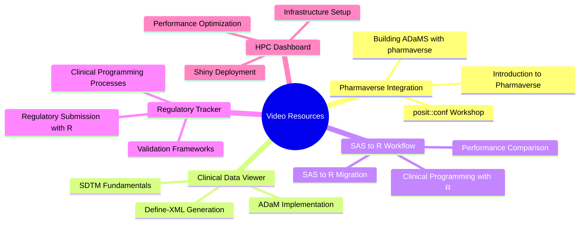

# YouTube Resources Guide for Senior Shiny Developer Position

## 🎥 **Pharmaverse YouTube Channel (Primary Resource)**

### **🌟 Official Pharmaverse Channel**
**Channel**: https://www.youtube.com/channel/UCxQFEv8HNqM01DXzdQLCy6Q

#### **Key Videos for Your Position:**

1. **[Introduction to the Pharmaverse](https://www.youtube.com/watch?v=nHbDmxjVqRM)**
   - **Content**: Overview of Pharmaverse ecosystem
   - **Relevance**: Understanding the open-source pharmaceutical R ecosystem
   - **Duration**: ~15 minutes
   - **Key Topics**: Pharmaverse mission, core packages, industry adoption

2. **[Building ADaMS with pharmaverse R packages](https://www.youtube.com/watch?v=uKE9LSWDNPg)**
   - **Content**: Step-by-step ADaM creation using admiral and metacore
   - **Relevance**: Directly matches your Pharmaverse Integration app
   - **Duration**: ~45 minutes
   - **Key Topics**: admiral functions, metacore metadata, ADaM structure

3. **[posit::conf Workshop: Leveraging & Contributing to the Pharmaverse](https://www.youtube.com/watch?v=iOOiNG2t-Dc)**
   - **Content**: Advanced workshop on Pharmaverse usage
   - **Relevance**: Shows professional-level Pharmaverse integration
   - **Duration**: ~60 minutes
   - **Key Topics**: Advanced usage, contribution, best practices

---

## 🎯 **CDISC SDTM/ADaM Training Videos**

### **📚 Complete CDISC SDTM ADaM Training**
**Playlist**: https://www.youtube.com/playlist?list=PLbW_LFBIHlxu2abXtm0KE3HSZu1YCuRMO

#### **Key Videos:**
1. **SDTM Fundamentals**
   - Understanding SDTM structure
   - Domain creation and validation
   - Regulatory compliance requirements

2. **ADaM Implementation**
   - Analysis dataset creation
   - Parameter derivation
   - Traceability and validation

3. **Define-XML Generation**
   - Metadata documentation
   - Regulatory submission requirements
   - Automation tools

---

## 🚀 **R Shiny Clinical Development Videos**

### **🔧 Clinical Programming with R**

#### **Recommended Videos:**
1. **[Coding Typical Clinical Processes Using R for the Entry Level](https://www.youtube.com/watch?v=DLtHluzoNS4)**
   - **Content**: Clinical programming workflows in R
   - **Relevance**: Shows R replacing SAS in clinical trials
   - **Key Topics**: Data processing, validation, reporting

2. **Using R-Shiny Capabilities in Clinical Programming**
   - **Content**: Shiny applications for clinical data
   - **Relevance**: Directly relevant to your portfolio
   - **Key Topics**: Interactive dashboards, data visualization

---

## 📊 **SAS to R Migration Videos**

### **🔄 Migration Strategies**

#### **Key Topics Covered:**
- SAS to R conversion strategies
- Performance comparison
- Validation and testing
- Regulatory considerations

#### **Search Terms for Additional Videos:**
- "SAS to R migration clinical trials"
- "R programming pharmaceutical industry"
- "Clinical data analysis with R"
- "Regulatory submission with R"

---

## 🌐 **Deployment and Infrastructure Videos**

### **🚀 Shiny Deployment Options**

#### **Posit Connect & Shiny Server:**
1. **[Posit Connect Overview](https://www.youtube.com/results?search_query=posit+connect+tutorial)**
   - **Content**: Enterprise deployment platform
   - **Relevance**: Production deployment for clinical apps
   - **Key Topics**: Authentication, monitoring, scaling

2. **[Shiny Server Configuration](https://www.youtube.com/results?search_query=shiny+server+tutorial)**
   - **Content**: Open-source deployment option
   - **Relevance**: Cost-effective deployment solution
   - **Key Topics**: Setup, configuration, security

---

## 🎯 **Video Watching Strategy for Interview Preparation**

### **📅 Recommended Viewing Order:**

#### **Week 1: Foundation (2-3 hours)**
1. **Day 1**: Introduction to the Pharmaverse (15 min)
2. **Day 2**: Coding Typical Clinical Processes Using R (30 min)
3. **Day 3**: SDTM Fundamentals (45 min)

#### **Week 2: Technical Skills (3-4 hours)**
1. **Day 1**: Building ADaMS with pharmaverse (45 min)
2. **Day 2**: ADaM Implementation (60 min)
3. **Day 3**: Define-XML Generation (30 min)

#### **Week 3: Advanced Topics (2-3 hours)**
1. **Day 1**: posit::conf Workshop (60 min)
2. **Day 2**: Shiny Deployment tutorials (45 min)
3. **Day 3**: SAS to R migration videos (30 min)

---

## 🎥 **Video Content Mapping to Your Portfolio**

### **📊 Your Apps vs Video Content:**

---

## 🔍 **How to Use These Videos for Interview Prep**

### **🎯 Before Interview:**

#### **1. Watch Key Videos**
- **Must Watch**: Introduction to Pharmaverse, Building ADaMS
- **Recommended**: Clinical Programming with R, Deployment tutorials
- **Optional**: Complete CDISC training playlist

#### **2. Take Notes on Key Points**
- **Pharmaverse benefits**: Standardization, efficiency, compliance
- **Technical details**: admiral functions, metacore usage
- **Industry context**: Why companies are adopting R
- **Deployment options**: Posit Connect vs Shiny Server

#### **3. Practice Explaining Concepts**
- **Pharmaverse ecosystem**: "It's an open-source collaboration..."
- **ADaM creation**: "Using admiral, I can create analysis datasets..."
- **SAS to R migration**: "The migration involves converting DATA steps..."

### **🚀 During Interview:**

#### **1. Reference Video Content**
- *"I learned from the Pharmaverse YouTube channel that..."*
- *"As shown in the Building ADaMS video..."*
- *"The clinical programming videos demonstrate..."*

#### **2. Demonstrate Continuous Learning**
- *"I stay current through Pharmaverse resources..."*
- *"I follow the latest developments in R for clinical..."*
- *"I've studied the migration strategies shown in..."*

#### **3. Connect to Your Experience**
- *"Similar to the video examples, I implemented..."*
- *"Building on the concepts from the Pharmaverse workshop..."*
- *"The deployment tutorials helped me configure..."*

---

## 📈 **Additional Video Resources**

### **🔍 Search Terms for More Content:**
- "R Shiny clinical dashboard"
- "Pharmaceutical data analysis R"
- "CDISC SDTM ADaM R tutorial"
- "Clinical trial reporting with R"
- "R programming regulatory submission"
- "Posit Connect healthcare"
- "Shiny Server pharmaceutical"

### **📺 Recommended Channels:**
1. **Pharmaverse** - Primary resource for pharmaceutical R
2. **Posit (RStudio)** - Shiny development and deployment
3. **R Consortium** - R in industry applications
4. **Appsilon** - R solutions for life sciences

---

## 🎯 **Key Takeaways from Video Content**

### **🌟 Pharmaverse Ecosystem:**
- **Collaboration**: Major pharma companies working together
- **Standardization**: Common tools and approaches
- **Innovation**: Open-source development model
- **Efficiency**: Reduced redundant development

### **🔧 Technical Skills:**
- **admiral**: ADaM creation and validation
- **metacore**: Metadata management
- **xport**: SAS file integration
- **Shiny**: Interactive applications

### **🚀 Industry Trends:**
- **SAS to R migration**: Growing trend in pharma
- **Regulatory acceptance**: FDA/EMA approval of R
- **Open source adoption**: Cost-effective solutions
- **Cloud deployment**: Scalable infrastructure

---

## 📱 **Quick Reference Links**

### **🎥 Essential Videos:**
1. **[Pharmaverse Introduction](https://www.youtube.com/watch?v=nHbDmxjVqRM)**
2. **[Building ADaMS](https://www.youtube.com/watch?v=uKE9LSWDNPg)**
3. **[posit::conf Workshop](https://www.youtube.com/watch?v=iOOiNG2t-Dc)**
4. **[Clinical Programming](https://www.youtube.com/watch?v=DLtHluzoNS4)**

### **📚 Complete Playlists:**
- **[CDISC SDTM ADaM Training](https://www.youtube.com/playlist?list=PLbW_LFBIHlxu2abXtm0KE3HSZu1YCuRMO)**
- **[Pharmaverse Channel](https://www.youtube.com/channel/UCxQFEv8HNqM01DXzdQLCy6Q)**

### **🔍 Additional Resources:**
- **[Appsilon YouTube](https://www.youtube.com/c/Appsilon)**
- **[Posit YouTube](https://www.youtube.com/c/posit)**
- **[R Consortium](https://www.youtube.com/c/RConsortium)**

These video resources provide comprehensive coverage of the Senior Shiny Developer workflow and will help you stay current with industry best practices!
